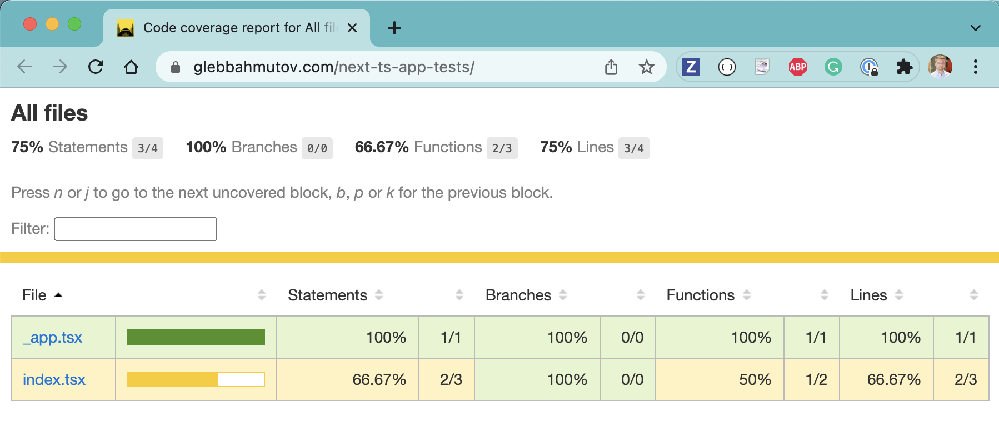

# next-ts-app-tests  [](https://circleci.com/gh/bahmutov/next-ts-app-tests/tree/main) [](https://github.com/bahmutov/next-ts-app-tests/actions/workflows/ci.yml)

> Cypress tests for [bahmutov/next-ts-app](https://github.com/bahmutov/next-ts-app) repo

Read the blog post [Code Coverage For Nextjs Application](https://glebbahmutov.com/blog/code-coverage-for-nextjs-app/)

## Test the deployed application

```
$ DEBUG=code-coverage CYPRESS_baseUrl=https://next-ts-app-swart.vercel.app/ npx cypress open
```

## Code coverage report

The code coverage report is produced on CI using [workflows/ci.yml](./.github/workflows/ci.yml) and hosted at GitHub Pages at [https://glebbahmutov.com/next-ts-app-tests/](https://glebbahmutov.com/next-ts-app-tests/)


